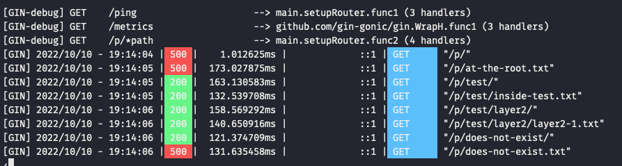

<h1 align="center">
  <br>
  <a href="http://github.com/ghostsquad/s3-file-explorer"></a>
  <br>
  S3 File Explorer
  <br>
</h1>

<p align="center">
  <a href="#introduction">Introduction</a> •
  <a href="#getting-started">Getting Started</a> •
  <a href="#contributing">Contributing</a> •
  <a href="#roadmap">Roadmap</a>
</p>

## Introduction

A Simple S3 File Explorer. Make a request to `/p/` to see what's in the configured bucket.

## Getting Started

```shell
task run
```

In a separate shell

```shell
task http:paths

task http:metrics
```

### Configuration

Configuration is done via environment variables. Standard AWS SDK Environment variables supported, as well as OIDC/EC2 authentication methods.

| Variable       | Required | Default                              | Description                                                    |
|----------------|----------|--------------------------------------|----------------------------------------------------------------|
| `AWS_BUCKET`   | no       | `github-ghostsquad-s3-file-explorer` | The AWS Bucket to explorer                                     |
| `PORT`         | no       | `8080`                               | The listen port                                                |
| `BIND_ADDRESS` | no       |                                      | Configured to listen on 127.0.0.1, this may not work in Docker |

## Contributing

```shell
brew install asdf
asdf plugin-add task https://github.com/particledecay/asdf-task.git
asdf plugin add python

asdf install

task test
```

## Roadmap

- [ ] Make a roadmap

### Known Issues

1. I have unit tests, and I manually ran some integration tests, but not all integration tests work, so I need to understand a bit more about how gin handles trailing slashes, AWS prefix expectations, etc.

    

2. I had to use the Docker Image deployment method because building wasn't going to work, as I'd have some drift in how I configured some build args.
3. There's a slew of app optimizations still left, such as separating `/ping` and `/metrics` endpoints onto different listeners, make logging configurable between text/color and JSON and some other things. This was my first time using Gin.
4. I didn't write any terraform/pulumi code to use OIDC to authenticate the app. I would prefer that over what I did manually (create a user and access key), but those environment variables were part of the original requirements.
5. I didn't configure test coverage or pay attention to that much. Just wrote a few small unit tests and a sanity-check end2end test (just verifies that the app runs and I can /ping it) via docker-compose.

## Attribution

<a href="https://www.flaticon.com/free-icons/function" title="function icons">Function icons created by Freepik - Flaticon</a>